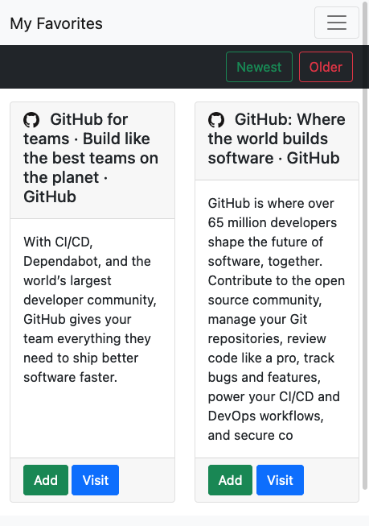
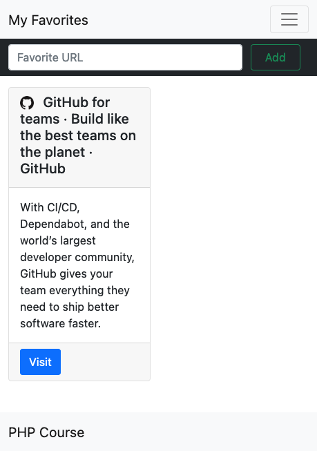
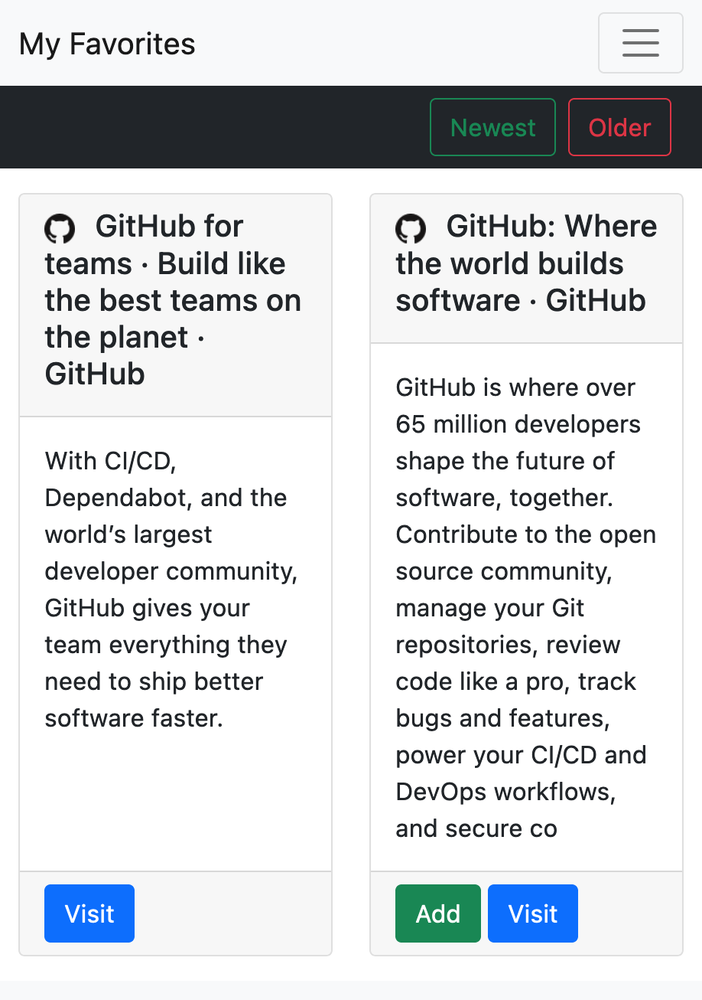

# 🎓  TP - PHP BDD

**Vous allez être évalués sur votre capacité à atteindre les objectifs fonctionnels 📝 suivants.**

Vous pouvez utiliser les `variables`, `conditionnelles`, `boucles`, `exceptions`, `fonctions`, `super globales`, `hachage`, `accès fichier`, `pdo` dans une structure de projet avec routage et séparation vue/controlleur sur une thématique que vous avez choisis.

### Précédement

Vous avez travaillé sur l'ajout d'un favoris par un membre puis l'affichage des favoris de tous les membres avec un tris par date.

### Maintenant

Vous allez procéder à de la logique métier et allez travailler vos requêtes SQL.

___

## 👨🏻‍💻 Création/Lecture

### Création

> Les utilisateurs peuvent s'ajouter les favoris d'autres utilisateurs.

* 📝 `"/favorites"`: Chaque favoris doit avoir un bouton ajouter.

* 📝 `"/favorites"`: En cliquant sur le bouton ajouter, 
  le membre peut ajouter le favoris à sa collection.

* 📝 `"/favorites"`: En cliquant sur le bouton ajouter,
  le membre est redirigé à la page d'accueil "/".
  

&nbsp;&nbsp;&nbsp; 

Attention. Quand le membre supprime le favoris de sa liste, pas question qu'il supprime celui d'un autre utilisateur, vérifiez le comportement!

### Lecture

> Les utilisateurs ne peuvent pas s'ajouter leur propre favoris

* 📝 `"/favorites"`: Chaque favoris que l'utilisateur ne possède pas doit avoir un bouton ajouter.

&nbsp;&nbsp;&nbsp; 

___

## 🐱 Next

> Vous commencez à rentrez dans la logique métier du projet.

### Répétition générale

Afin de reprendre les notions depuis le départ et pour arriver à un même objectif je vous invite à initier un projet personnel.

* 📝 Sans vous limitez et à plusieurs, organisez une séance d'idée de projets.

* 📝 A titre individuel,n choisissez une thématique et identifiez les grandes lignes des foncitonnalitée.

* 📝 Initialisez votre nouveau projet!

___

## 🕕 Gérez votre temps