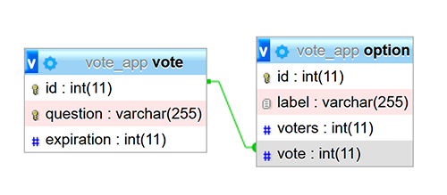

# 🎓  TP - PHP

**You will be evaluated on your ability to meet the following 📝 functional goals.**

You can use `echo`, `header`, `include`, `variable`, `conditionnal`, `loop`, `function`, `super globals`  decomposition with `view`, `controller` and `entity` layouts.

## 🐥 Previously

You're working on a function named `create` to create a vote.

## 🦆 Now

You're gonna create the database schema, use an object to create a connection then insert our data.

___

### 👨🏻‍💻 Entities

> 🛑 Manage your database scheme with PHPStorm or PHPMyAdmin.

📝 You have to create the following scheme, are free to use different table or column name. The id's must use `autoincrement`, it mean the id value do not have to be filled manually and will increment automaticly at every insertion.



The idea as presented for this relation is to provide following storage.

> Do not take care about to rely an user to a vote because we can do this relation using `sessions` and without an user table.

*Table `vote`*

|id|question|expiration|
|-|-|-|
|4|Votre pays préféré|1599721200|

*Table `option`*

|id|label|voters|vote|
|-|-|-|-|
|14|France|342|4|
|14|Angleterre|242|4|
|14|Italie|312|4|

___

⚡ Probably PHPStorm will fail at column creation: provide a size for your columns. The syntax for a table definition is the following.

```sql
CREATE TABLE `vote` (
  `id` int(11) NOT NULL PRIMARY KEY AUTO_INCREMENT,
  `question` varchar(255) NOT NULL,
  `expiration` int(11) NOT NULL
) ENGINE=InnoDB DEFAULT CHARSET=utf8mb4;
```

As observed we have to determine a relation between the two table. The column `vote` of the table `option` must be in relation  with the column `id` of the table `vote`.

🔍 You can check graphically your database scheme using right click on your database the diagrams/Show Visualisation.

___

### 👨🏻‍💻 Connection

> 🛑 Create a new connection.

To create a new connection from a PHP script we have the Php Data Object (PDO) type. It accept a setting at creation and open a connection for us to make your statements. 

*The first argument is the `data source name`, the second for the `user name` then the third for the `password`. In fourth and optionnal arguments there is `options`, it's recommended to use the exception mode for a better errors handling.*

```php
// Database Handler
$dbh = new PDO(
    "mysql:host=localhost;dbname=app_vote;charset=UTF8",
    "root",
    "",
    [PDO::ATTR_ERRMODE => PDO::ERRMODE_EXCEPTION]
);
```

📝 You have to create a function named `getConnection` who provide a new instance of PDO. This function must be in a file `database.php` in the folder `src/service`.

> The `service` folder is a new layout for our project. It contain functions that give us services! Every business logic must be placed in the service folder.

___

### 👨🏻‍💻 Insertion

> 🛑 Insert your data.

With an instance of PDO you can make statements. Steps are the following, `prepare` a statement, `execute` your statement with value binding.

```php
// Statement handler
$sth = $dbh->prepare(
    "INSERT INTO `vote`(`question`, `expiration`) VALUES (:question, :expiration)"
);
$sth->execute([
    ":question" => "Votre pays préféré",
    ":expiration" => 1599721200,
]);
```

As you can observe, the statement INSERT have to precise the `table name`, the `column name list` and the `value list`. The values ar passed at execution for security reason. For auto incremented id there is not need to provide a value.

⚡ When you have table in relations, you have to retrieve the id generated for the next insertion in the table in relation (you need your vote id for perform option insertion). You can retrieve the last insered id with the `lastInsertId` method.

```php
$id = $dbh->lastInsertId();
```

📝 You have insert the `vote` and the` option list` in your tables when the form is valid.

📝 After insertion you have to make a redirection to "/votes".

___

### 👨🏻‍💻 Selection

> 🛑 Read your data.

With a PDO Statement we can execute statements. 

📝 Use the console to execute and understand following queries.

With a SELECT we can read data from the database.

```sql
SELECT * FROM `vote`;
```

You can limit your selection using LIMIT.

```sql
SELECT * FROM `vote` LIMIT 10;
```

You can limit order your selection using `ASC` or `DESC`.

```sql
SELECT * FROM `vote`  ORDER BY `vote`.`id` DESC LIMIT 10;
```

With the clause WHERE we affine our results, we will have to make a statement for each vote to retrieve associated option.

```sql
SELECT * FROM `option` WHERE `option`.`vote` = 1;
```

With a statement handler, for fetch data you have to use the `fetch` or `fetchAll` method. You can chose your `fetch mode` for map the data an an associative array, an object or others.

```php
$sth = $dbh->prepare("SELECT * FROM `vote`");
$sth->execute();
$results = $sth->fetchAll(PDO::FETCH_OBJ);
```


📝 On the vote list page '/votes', select then display the 10 last votes.

📝 On the vote page '/votes?id=2', select then display all related options and the number of voters for each option.

___

### 👨🏻‍💻 Refactoring

Your entity is not the exact reflection of your table.

📝 Refactor your code.

___

## 🐧 Next

> 🛑 Vote.

📝 On the vote page, display a form with input radio for options.

📝 On the vote page, handle the form data then increment the number of voters for the voted option.

The UPDATE statement atempt to have column with affected value.

```sql
UPDATE `option` SET voters = voters + 1 WHERE id = 1;
```

> 🛑 Restrict.

You can remember that the current user perform action on the website, you can register in a particular super gllobal data that is available from page to page.

🔗 [documentation](https://github.com/seeren-training/PHP/wiki/10#-start)


📝 Store in the session vote that have been voted and do not provide make possible for an user to vote again for a vote already voted.

___

## 🕕 Manage your time

There is some logic coming to target your functional goal!
