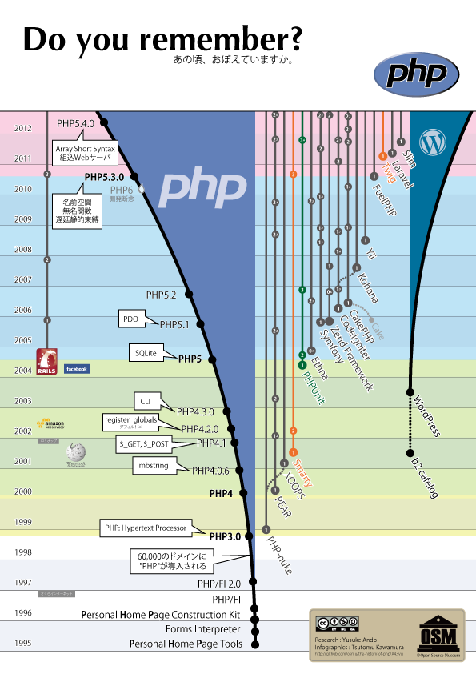
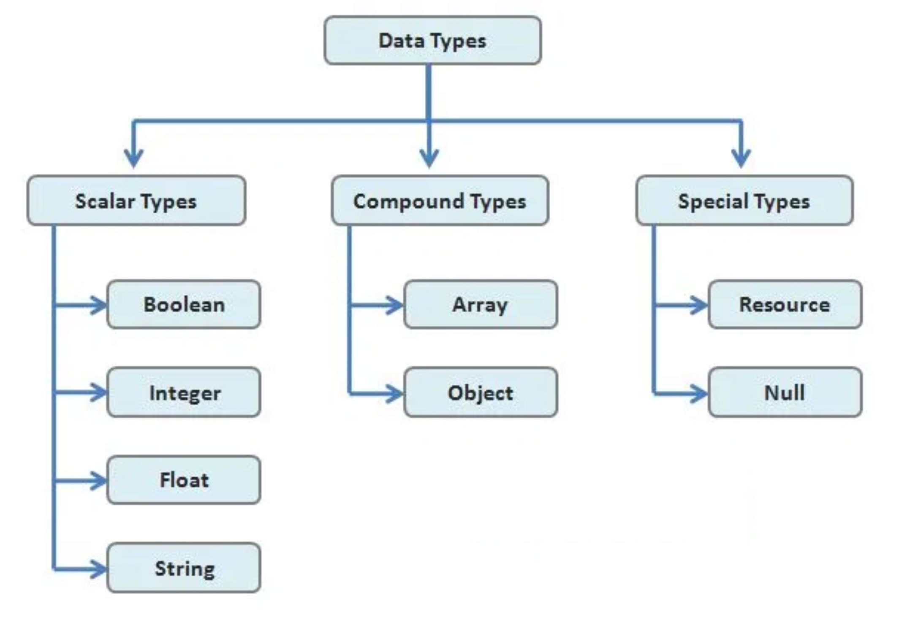
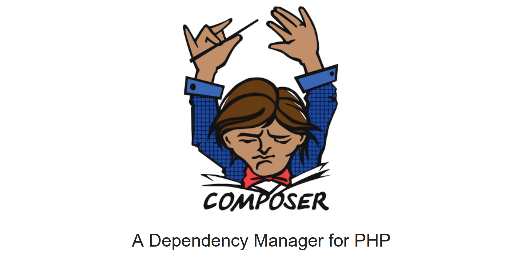

# Introduction

*  🔖 **Historique**
*  🔖 **Data types**
*  🔖 **Server**
*  🔖 **Manager**
*  🔖 **Projet**

___

## 📑 Historique

PHP est un "langage de programmation" libre, principalement utilisé pour produire des pages Web dynamiques via un serveur HTTP, mais pouvant également fonctionner comme n'importe quel langage interprété de façon locale. PHP a permis de créer un grand nombre de sites web célèbres, comme Facebook et Wikipédia. Il est considéré comme une des bases de la création de sites web dits dynamiques mais également des applications web. 

> I don't know how to stop it, there was never any intent to write a programming language.

* **1994**:  Rasmus Lerdorf release PHP 1 - Personal Home Page.

* **1997**: Zeev Suraski et Andi Gutmans release PHP3 - Hypertext Preprocessor.
* **2000**: PHP 4, powered by the Zend Engine 1.0 introduit le mot class.
* **2004**: PHP 5, powered by the Zend Engine 2.0, le model objet gagne en maturité.
* **2015**: PHP 7, powered by the Zend Engine 3.0, les performance sont améliorés et le typage est renforcé.



___

## 📑 Data types

PHP est un langage au typage faible et dynamique.



___


## 📑 Server

PHP est un langage Back End. Il est alors interprété par sur un serveur et il nous faut un serveur local pour développer.

### 🏷️ **Installation**

En fonction de votre environnement, il existe des serveur avec **A**pache/**M**ySQL/**P**HP/**P**HPMyadmin.

* [xampp](https://www.apachefriends.org/fr/index.html)
* [wampp](https://www.wampserver.com/)
* [mamp](https://www.mamp.info/en/downloads/)

___

👨🏻‍💻 Manipulation

Installez un serveur en fonction de votre environnement.

___

* Apache

Le logiciel libre Apache HTTP Server est un serveur HTTP créé et maintenu au sein de la fondation Apache. Jusqu'en avril 2019, ce fut le serveur HTTP le plus populaire du World Wide Web.

* MySQL

MySQL est un système de gestion de bases de données relationnelles. Il est distribué sous une double licence GPL et propriétaire.

* PhpMyAdmin

PhpMyAdmin est une application Web de gestion pour les systèmes de gestion de base de données MySQL réalisée principalement en PHP et distribuée sous licence GNU GPL.

___

👨🏻‍💻 Manipulation

Vérifiez vos installations en accédant à PhpMyAdmin et en vérifiant votre version de PHP dans un terminal. S'il n'est pas reconnu veuillez l'ajouter à votre variable d'environnement path.

```bash
php -v
```

___


## 📑 Manager

La question à se poser quand vous commencer un nouveau langage c'est: quel est son package manager?

> Il sera utile pour installer des dépendances comme une librairie, un framework, pour initialiser un projet afin que sa version de PHP soit explicite ou encore  pour charger vos classes...


### 🏷️ **[Composer](https://getcomposer.org/)**

Composer est le package manager pour l'ecosystme PHP, les package installables reposent sur le site associé [packagist](https://packagist.org/).


___

👨🏻‍💻 Manipulation

Installez composer et vérifiez votre installation en obtenant la liste de ses commandes dans un terminal. S'il n'est pas reconnu veuillez l'ajouter à votre variable d'environnement path.

```bash
composer
```

___

