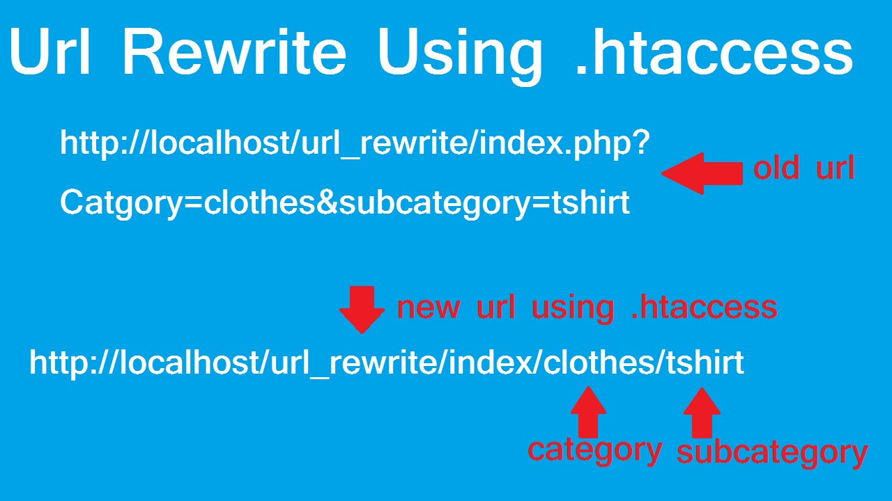

# Environnement

*  🔖 **Exécution**
*  🔖 **Rewrited**
*  🔖 **Project**
*  🔖 **Standards**

___

## 📑 Exécution

Vous avez plusieurs solutions pour intépréter PHP.


### 🏷️ **Balise**

PHP est interprété à l'ouverture d'une balise PHP.

```php
<?php

echo "Hello php";
```

En dehors des balises PHP il n'est plus interprété.

```php
<?php

echo "Hello php";

?>

Simple texte
```

___

👨🏻‍💻 Manipulation

Créez un fichier index.php avec le contenu çi dessus que nous voulons interpréter.

___

Nous allons observer comment exécuter un fichie PHP.

### 🏷️ **Pannel**

En appuyant sur la touche `start` ou `lunch` de votre control pannel, un host et un port par défaut sont disponibles. Ils déservent le dossier public de votre serveur web, à savoir le dossier `htdocs` ou `www`.

___

👨🏻‍💻 Manipulation

Exécutez votre script en vous rendant à l'adresse: `http://localhost/index.php`

Arrétez le server en cliquand sur `stop` de votre control pannel.

___

### 🏷️ **Built in**

PHP dispose d'un [Built in server](https://www.php.net/manual/en/features.commandline.webserver.php), il est utile pour développer. Vous n'êtes pas obligés d'avoir vos scripts dans le dossier public de votre serveur.

Pour démarrer le server, utiisez la commande suivante dans un terminal situé à l'emplacement de votre script.

```bash
php -S localhost:8000
```

Si vous souhaitez exécuter un script situé dans un autre dossier il faut utiliser l'option target.

```bash
php -S localhost:8000 -t my-directory
```

___

👨🏻‍💻 Manipulation

Exécutez votre script en vous rendant à l'adresse: `http://localhost:8000/index.php`

Arrétez le server avec `ctrl + c`.

___

### 🏷️ **CLI**

PHP peut s'éxécuter avec des instructions en ligne de commande. Le mode interactive s'initialise avec l'option `-a`.

```bash
php -a
```

Les instructions sont attendues et le output se fait dans le terminal.

```bash
php > echo "Hello Cli";
```

___

## 📑 Rewrited

Comme vous le constatez il n'est pas possible par défaut d'obtenir des url personnalisées. Ainsi vous exposez le nom de vos scripts et êtes limités pour fournir des url user friendly ce qui est une mauvaise pratique.



> Que vous utilisiez l'une ou l'autre des éxécutions il nous faut activer la réécriture d'URL, c'est à dire le fait de pouvoir avoir l'url http://localhost/user/2 et qu'on ne tombe pas sur une page dobjet non trouvé. En PHP toutes les url doivent exécuter votre script principal, votre index.php situé à la racine de votre dossier public. C'est le point d'entré de votre programme.

### 🏷️ **.htaccess**

Pour ce faire nous allons dans un fichier donner des directive au server apache. Le fichier .htaccess contient ces directives.

*.htaccess*

```bash
# Deny access to the .htaccess file and will trigger a 403 status code
<Files .htaccess>
    order allow,deny
    deny from all
</Files>
#Turn RewriteEngine to On
RewriteEngine On
#Deliver static file
RewriteCond %{REQUEST_FILENAME} -f
RewriteRule ^ - [L]
#Trigger index.php and add query string append flag
RewriteRule ^(.*)$ index.php [QSA,L]
```

Ce fichier donne les directives suivanes:
* Interdit sa consultation.
* Active le write engine.
* Permet que les fichiers présents sur disque soit délivrés.
* Réécrit toutes les url vers le fichier index.php en lui passant les paramètres d'url s'ils sont présents.

___

👨🏻‍💻 Manipulation

Placez un fichier de directives apache à côté de votre index.php et constatez que vous pouvez avoir des url réécrites.

___

## 📑 Projet

Nous nous appretons à découvrir le language PHP, je vous invite à le faire en visant des objectifs fonctionnels. De ce fait nous allons voter pour une thématique de projet avant d'initiatliser un projet.

___

👨🏻‍💻 Manipulation

Déterminer une thématique de projet en choissant parmi celles exposées ou en proposant des thématiques.

___


### 🏷️ **Initialisation**

La commande `init` initialise un projet, répondez aux questions ou passez. Un fichier de configuration pour notre projet est généré à la racine du projet.

```bash
composer init
```

___

👨🏻‍💻 Manipulation

Initialisez votre projet.

___


### 🏷️ **Structure**

Bien que nous soyons en procédural, nous suivrons comme [organisation de projet](https://symfony.com/doc/current/best_practices.html#use-the-default-directory-structure) celle du cadre applicatif Symfony qui sera étudié plus tard en prennant quelques libertées.


```bash
project-name/
|
├─ config/
│
├─ public/
│   ├─ .htaccess
│   └─ index.php
|
├─ src/
│   ├─ controller/
│   ├─ entity/
│   ├─ form/
│   ├─ repository/
│   └─ services/
|
├─ templates/
|
└─ var/
    └─ cache/
```

Notre obejctif pendant la formation sera de comprendre la responsabilité de chaque dossier et de maîtriser la syntaxe du language pour réussir nos objectifs fonctionnels.

___

👨🏻‍💻 Manipulation

Créez la structure de votre projet.

___
