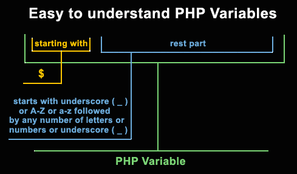
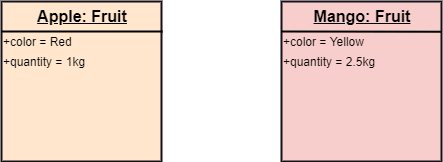

# Variables

*  🔖 **Déclarations**
*  🔖 **Types**
*  🔖 **Tableaux**
*  🔖 **Object**

___

## 📑 Déclarations

Le `$` permet de déclarer une variable



### 🏷️ **[Var](https://www.php.net/manual/fr/language.variables.php)**

```php
$foo;
```

En cas de passage par référence il est possible de ne pas affecter de valeur à une variable. Hormis ce cas vous devez fournir une valeur, le type n'est pas à éclarer et il peut varier.

```php
$foo = true;
$foo = "Hello";
```

Une variable peut se télescoper de son bloc d’exécution.

```php
if (true) {
    $foo = "Hello";
}
echo $foo; // Hello
```

Une variable en dehors d'une fonction est dite "globale".

### 🏷️ **[Dynamisme](https://www.php.net/manual/fr/language.variables.variable.php)**

Les identifiants de variables sont dynamiques, c'est une force.

```php
$foo = "bar";
$$foo = "baz";
echo $bar; // baz
```

La bonne pratique est d'utiliser la priorité de calcul d'identifiant.

```php
$foo = "bar";
${$foo} = "bazd";
echo $bar; // baz
```

Ceci peut être pratique quand vous chainer des interprétations de valeur, comme construire un objet à partir d'un identifiant dynamique stocké sur attribut identifié dynamiquement. Nous en aurons l'utilisé un jour.

### 🏷️ **Référence**

Une variable peut être déclarée comme étant une référence d'une autre variable. Sa modification modifiera l'originale.

```php
$foo = "bar";
$bar = &$foo;
$bar = "baz";
echo $foo; // baz
```

C'est utile quand une fonction modifie une variable en utilisant sa référence plutot que d'utiliser une valeur de retour.

### 🏷️ **[Constantes](https://www.php.net/manual/fr/language.constants.php)**

Les constantes sont des espace de stockages dont la valeur ne peut pas varier. Elle est accéssible en lecture mais pas en écriture.

Pour les déclarer il faut utiliser la fonction `define`.

```php
define("FOO", "Hello");
```

Pour y accéder il faut simplement utiliser l'identifiant de la constante.

```php
echo FOO; // "Hello"
```

___

## 📑 [Types](https://www.php.net/manual/fr/language.types.php)

* Null

```php
var_dump(null);
```

### 🏷️ **Primitifs**

* Booléen

```php
var_dump(true);
```

* Integer

```php
var_dump(7);
```

* Float

```php
var_dump(7.7);
```

* String

```php
$foo = 'foo';
```

La double quote permet d'interpoller des variables.

```php
$name = 'John';
$message = "Hello $name";
echo $message; // Hello John
```

Moins populaire le HEREDOC existe pourtant, nous passerons sur la NOWDOC. L'identifiant de fin de bloc ne doit pas être indenté.

```php
$name = 'John';
echo <<<FOO
    Hello $name
FOO;
```

___

👨🏻‍💻 Manipulation

Déclarer des variables et utiliser les dans des templates pour les informations qui devront varier à l'avenir.

___

## 📑 Tableaux

Les tableaux  ne sont pas dimensionnés et pas typés.

### 🏷️ **[Déclaration](https://www.php.net/manual/fr/function.array.php)**

Il est possible de déclarer un tableau en utilisant le fonction `array`

```php
$foo = array();
```

Il est possible de préremplir le tableau de valeurs.

```php
$foo = array('foo', 'bar', 'baz');
```

La déclaration littérale utilise les crochets.

```php
$foo = [];
```

Il est possible de préremplir le tableau de valeurs.

```php
$foo = ['foo', 'bar', 'baz'];
```

#### **Associatif**

Par défaut chaque élément du tableau est associé à un indice numérique pour pouvoir y accéder. Sur ce langage il est possible de choisir les indices des éléments, c'est l'équivalent d'une map.


```php
$colorList = [
    'red' => '#ff0000',
    'green' => '#00ff00',
    'blue' => '#ff0000',
];
```

### 🏷️ **[Manipulation](https://www.php.net/manual/fr/ref.array.php)**

#### **Accéder à un élément d'un tableau**

Il faut se référer à ses indexes.

```php
echo $foo[1]; // bar
```

#### **Taille**

```php
echo count($foo); // 3
```

#### **Supprimer un élément**

La fonction `array_shift` renvoie et supprime le premier élément du tableau puis réorganise les clefs du tableau.

```php
echo array_shift($foo); // foo
```

La fonction `array_pop` renvoie et supprime le dernier élément du tableau.

```php
echo array_pop($foo); // baz
```

La méthode `splice` modifie le contenu d'un tableau en retirant des éléments et/ou en ajoutant de nouveaux éléments à même le tableau puis le réindexé.

```php
array_splice($foo, 2, 1);
```

#### **Ajouter un élément**

La fonction `array_unshift` ajoute un élément au début, renvoie sa nouvelle taille puis réorganise les clefs du tableau.

```php
echo array_unshift($foo, 'qux'); // 4
```

La fonction `array_push` ajoute un élément à la fin, renvoie sa nouvelle taille puis réorganise les clefs du tableau.

```php
echo array_push($foo, 'thud'); // 4
```

___

## 📑 Object

Loin d'aprendre la programmation objet maintenant, penchons nous sur ce type.



Tous les objets possèdent une valeur qui est modifiée par référence: quand vous passerez un objet en argument et que vous le modifiez, vous ne modifiez pas une copie comme pour les types primitifs, il sera modifié dans le contexte d'appel.

### 🏷️ **Déclaration**

Il existe de nombreux objets intégrés et vous pouvez en définir également.

* Instancier un `constructeur`.

```php
$obj = new stdClass();
```

Un constructeur standard est disponible avec la class `stdClass`. C'est une class dont vous pouvez ajouter et récupérer les attributs de façon publiques.

### 🏷️ **Manipulation**

L'accès aux propriétés d'un objet se fait avec la flèche. Des propriétés non existantes peuvent être ajoutées à la volée.

```php
$obj->prop1 = true;
```

#### Supprimer une propriété

Que ce soit pour supprimer une variable ou une propriété d'un objet, la fonction `unset` détruit la référence.

```php
unset($obj->prop1);
```

### 🏷️ **Instanceof**

L'opérateur instanceof s'utilise pour vérifier si la première opérande est du type de la seconde.

```php
var_dump($obj instanceof stdClass);
```
___

👨🏻‍💻 Manipulation

Déclarez des tableaux associatifs ou des objets représentant la donnée que vous voulez exploiter, stockez les dans le dossier `entity`. C'est la couche model que vous représentez actuellement.

Utlisez vos modèles dans votre vue.

___
