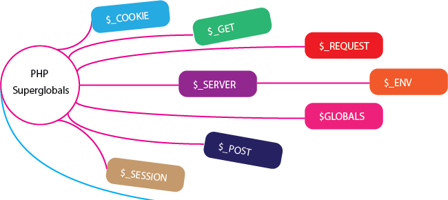

# Super Globales

*  🔖 **Définition**
*  🔖 **Server**
*  🔖 **Get**
*  🔖 **Post**

___



## 📑 [Définition](https://www.php.net/manual/fr/language.variables.superglobals.php)

Les Superglobales sont des variables internes qui sont toujours disponibles, quel que soit le contexte.

Plusieurs variables prédéfinies en PHP sont "superglobales", ce qui signifie qu'elles sont disponibles quel que soit le contexte du script. Il est inutile de faire global $variable; avant d'y accéder dans les fonctions ou les méthodes.

> Il existe plusieurs super globales par thématique, nous observerons certaines de ces variables dans ce chapitre.

### 🏷️ **Accés**

Pour accéder à une super globale vous pouvez l'utiliser comme n'importe quelle variable.

```php
var_dump($_SERVER);
```

Vous constaterez que c'est un tableau assicatif et pouvez accéder à ses éléments avec ses indices.

```php
echo $_SERVER["REMOTE_ADDR"]; // ::1
```

Le problème avec ces variables c'est qu'elles sont disponibles en écriture.

```php
$_SERVER = null;
```

Mais ce sont pourtant des valeurs que nous souhaitons comme constante pour ne pas être induit en erreur.

Le second problème est la vérification à faire avant d'accéder à un élément du tableau pour ne pas risquer de se prendre un warning.

```php
if (array_key_exists("REMOTE_ADDR", $_SERVER)) {
    echo $_SERVER["REMOTE_ADDR"]; // ::1
}
```

De ce fait accéder directement à une uper globale est une mauvaise pratique.

### 🏷️ **Filter input**

Une meilleu pratique pour accéder aux variables globales et l'utilisation de `filter_input`. Vous pouvez accéder à un élément d'une super globale et sa valeur sera constante, peut importe le traitement qu'il sera fait à la variable.

```php
echo filter_input($_SERVER, "REMOTE_ADDR"); // ::1
```

Si l'élément n'est pas présent la valeur de retour sera `null`.

L'utilisation de filter_input devra être systématique pour accéder à ces variables, il faut noter que ce n'est pas encore implémenté pour $_SESSION.

___

## 📑 [Server](https://www.php.net/manual/fr/reserved.variables.server.php)

`$_SERVER` est un tableau contenant des informations comme les en-têtes, dossiers et chemins du script. Les entrées de ce tableau sont créées par le serveur web. Il n'y a aucune garantie que tous les serveurs les rempliront tous .

___

👨🏻‍💻 Manipulation

Relevez les variables utiles pour représenter l'url. Nous souhaitons la partie d'url qui ne comporte pas le host et le port. Relever les variables en fonction de votre contexte d'éxécution.

Vous pouvez alors multiplier vos page: utiliser cete variable et la structure conditionnelle pour passer par un controller ou un autre en fonction de la valeur de cette variable. Par exemple l'url "/products" affiche une liste de produits alors que "contact" affiche un formulaire de contact.

___

> La manipulation effectuée correspond à la première mise en place d'un routing: à partir d'un point d'entré et d'une donnée de requête vous décider d'éxécuter une action ou une autre pour fournir des réponse différentes.

___

## 📑 [Get](https://www.php.net/manual/fr/reserved.variables.get.php)

Un tableau associatif des valeurs passées au script courant via les paramètres d'URL (aussi connue sous le nom de "query string"). Notez que ce tableau n'est pas seulement rempli pour les requêtes GET, mais plutôt pour toutes les requêtes avec un query string.

Par exemple pour l'url suivante `/?foo=bar` vous pouvez constatez que le tableau contient:

```js
array(1) {
  ["foo"]=>
  string(3) "bar"
}
```

Cela sera pratique pour récupérer des paramètres via l'url.

___

👨🏻‍💻 Manipulation

Fournissez un lien vers l'affichage d'un item unitaire d'une liste. Par exemple `/products?id=1` doit afficher un produit de la liste des produits.

___

## 📑 [Post](https://www.php.net/manual/fr/reserved.variables.post.php)

Un tableau associatif des valeurs passées au script courant via le protocole HTTP et la méthode POST lors de l'utilisation de la chaîne application/x-www-form-urlencoded ou multipart/form-data comme en-tête HTTP Content-Type dans la requête.

Donc si une requête possède une métthode `POST` et une entête ` application/x-www-form-urlencoded` ou `multipart/form-data` généré automatiquement par les formulaires, alors le tableau associatif sera peuplé de la donnée postée.

### 🏷️ **Formulaire**

Pour envoyer une requête en `POST` avec un formulaire vous devez utiliser l'attribut method de la balise form.

```html
<form method="post" action="">
```

### 🏷️ **Input**

Pour qu'une valeur soit postée depuis un élément de formulaire, il faut que l'élément d'intereaction possède une valeur sur son attribut name.

```html
<input name="foo" />
```

En postant le formulaire détaillé avec un botton ou un input submit le tableau des POST sera peuplé de la manière suivante.

```js
array(1) {
  ["foo"]=>
  string(3) "valeur tappée par l'utilisateur"
}
```

___

👨🏻‍💻 Manipulation

Créez un formulaire pour créer une entité, un produit, un commentaire par exemple, à adapter selon votre thématique.

Attention, vous devez procéder à certains tests logiques, si le formulaire n'est pas correctement formulé, vous devez gérer l'affichage des erreur.
