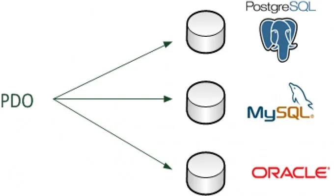

# PDO

*  🔖 **Définition**
*  🔖 **Instanciation**
*  🔖 **Prepare**
*  🔖 **Transaction**
*  🔖 **Stacité**

> Notre objectif sur ce chapitre est de manipuler les bases de données.

___



## 📑 [Définition](https://www.php.net/manual/fr/book.pdo.php)

L'extension PHP Data Objects (PDO) définit une excellente interface pour accéder à une base de données depuis PHP. Chaque pilote de base de données implémenté dans l'interface PDO peut utiliser des fonctionnalités spécifiques de chacune des bases de données en utilisant des extensions de fonctions. Notez que vous ne pouvez exécuter aucune fonction de base de données en utilisant l'extension PDO par elle-même ; vous devez utiliser un driver PDO spécifique à la base de données pour accéder au serveur de base de données. 

### 🏷️ **Configuration**

Dans le fichier `php.ini`, l'extension de votre driver doit être présente et linkée.

```ini
extension=mysqli
```
Les extensions se trouvent dans `php/ext/`. Pour l'extension décrite le fichier suivant doit être présent: `php_pdo_mysql.dll`.

### 🏷️ **Prérequis**

Les prérequis pour manipuler une base de données est la connaissanes d'un langage de base de données ainsi que sa structuration.

🔗 [Training SQL](https://github.com/seeren-training/SQL/wiki)

___

👨🏻‍💻 Manipulation

Metttez en palce une structure de donnée

___

## 📑 [Instanciation](https://www.php.net/manual/fr/pdo.construct.php)

Le `Data Source Name` en argument un doit posséder au moins **le type de drive et le host**.

```php
$dbh = new PDO(
    "mysql:host=some_hostlhost;dbname=some_database_name;charset=UTF8",
    "user",
    "password", [
        PDO::ATTR_ERRMODE => PDO::ERRMODE_EXCEPTION
    ]
);
```

Il est important de **spécifier en option le mode erreur** à exceptions afin de pouvoir attraper les levables facilement et ne pas tester chaque exécution.

___

👨🏻‍💻 Manipulation

Dans un dossier à déterminer, créez une fonction responsable de fournir une instance de PDO.

___

## 📑 [Prepare](https://www.php.net/manual/fr/pdo.prepare.php)

 Prépare une requête à l'exécution et retourne un objet.
 
### 🏷️ **Requête**

```php
$sth = $dbh->prepare("SELECT * FROM `product`");
```

### 🏷️ **Valeurs**

Afin de se prémunire de toute interprétation et donc injection SQL il est préférable de **spécifier les valeurs en dehors de la chaine de caractère SQL**

```php
$sth = $dbh->prepare("SELECT * FROM `product` WHERE `id`=:id");
$sth->bindValue(":id", 4);
```

### 🏷️ **[Exécution](https://www.php.net/manual/fr/pdostatement.execute.php)**

Exécute une requête préparée.
```php
$sth->execute();
```

### 🏷️ **[Lecture](https://www.php.net/manual/fr/pdostatement.execute.php)**

#### Lire une ligne

```php
$raw = $sth->fetch();
```

#### Lire plusieurs lignes

```php
$raws = $sth->fetchAll();
```

#### Personnaliser le mode de lecture

```php
$sth->setFetchMode(PDO::FETCH::ASSOC);
```

___

👨🏻‍💻 Manipulation

Piloter votre donnée en utilisat les bases de données.

___

## 📑 [Transaction](https://www.php.net/manual/fr/pdo.transactions.php)


Dans le cas de plusieurs éxécution, il est important de pouvoir annuler l'une d'entre elle si une erreur apparait. **La transaction permet de valider ou d'annuler un ensemble d'éxécutions** contenue dans un bloc

### 🏷️ **[Open](https://www.php.net/manual/fr/pdo.begintransaction.php)**

Démarre une transaction.

```php
$dbh->beginTransaction();
```

### 🏷️ **[Cancel](https://www.php.net/manual/fr/pdo.rollback.php)**

Annule une transaction.

```php
$dbh->rollBack();
```

### 🏷️ **[Valid](https://www.php.net/manual/fr/pdo.commit.php)**

Valide une transaction.

```php
$dbh->commit();
```

___

👨🏻‍💻 Manipulation

Utilisez le mécanisme de la transaction dans le cas de plusieurs modifications de la donnée.

___

## 📑 [Stacité](https://www.php.net/manual/fr/language.variables.scope.php#language.variables.scope.static)

La staticité peut aider à limiter le nombre d'instance en vie de PDO. Une variable statique a une portée locale uniquement, mais elle ne perd pas sa valeur lorsque le script appelle la fonction.

```php
function foo () {
    static $bar = 0;
    return ++$bar;
}
echo foo(); // 1
echo foo(); // 2
```

___

👨🏻‍💻 Manipulation

Utilisez la staticité pour réduire le nombre d'instance de PDO sans passer par les variables globales.

___